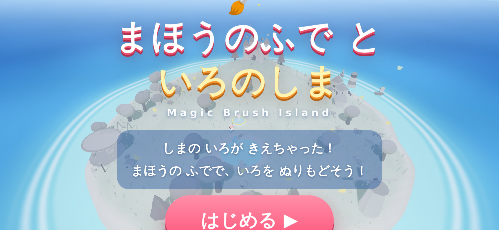
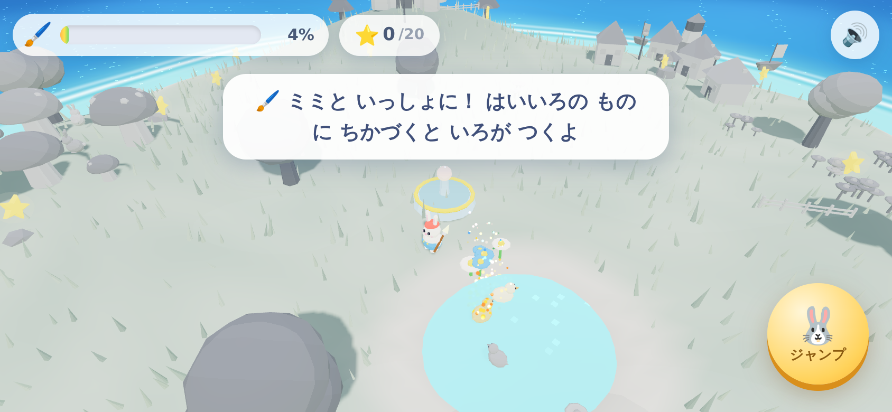
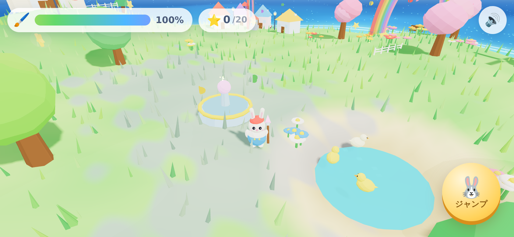

# 🖌️🌈 まほうのふで と いろのしま — Magic Brush Island

「ディズニー エピックミッキー」にインスパイアされた、**色をぬって世界をよみがえらせる 3D アドベンチャー**。
4歳のお子さまが iPhone / iPad で（たて画面でも よこ画面でも）安心して遊べるように作られています。



## 🎮 あそびかた

いろが消えて はいいろになってしまった島を、うさぎの画家 **ミミ** と いっしょに ぬりもどしてあげよう！

| そうさ | どうなる |
| --- | --- |
| 🖐️ 画面をドラッグ | ミミが歩く（どこをさわってもジョイスティックが出る） |
| 👆 はいいろのものをタップ | えのぐを ぽーんと 飛ばして ぬれる（近くならOK、ずれても当たる） |
| 🐰 ジャンプボタン | ぴょーん！ |
| 🚶 ちかづくだけ | まほうのふでが じどうで ぬってくれる |
| ⌨️ PCなら | 矢印キー / WASD ＋ スペースでジャンプ |

- **まけない・しなない・じかんせいげんなし。** できることは「きれいにすること」だけ。
- 6つのエリア（おはなばたけ・きのこのもり・みなとまち・もりのくに・おしろのおか・ゆうえんち）を全部ぬると、**地面いっぱいに色があふれ、虹がかかり**ます。
- 島をぜんぶぬると、夕焼けの空に**花火の大フィナーレ**！
- ⭐ 島にかくれた 20 個のほしをあつめるおまけミッションも。




## ✨ みどころ（3Dのこだわり）

- **色がもどる瞬間の演出** — プロップはグレーの鉛筆スケッチ状態から、ぽよんと弾んで鮮やかな色に開花。地面はゾーン完成時にシェーダーで**色が波のように広がる**
- **トゥーンシェーディング** ＋ ACES トーンマッピングによる絵本のような発色
- **カスタムシェーダーの空**（グラデーション＋太陽グロー）と**生きている海**（波・きらめき・浜辺の泡）
- 風にゆれる **2,400本のインスタンシング草原**（GPUで揺らす）
- まわる風車・メリーゴーラウンド、ゆれるブランコ、うかぶ気球、まわりを泳ぐウミガメ、空とぶ小鳥、ただよう浮島
- ぬると動き出す**どうぶつたち**（うさぎ・ひつじ・あひる）— 近づくとハートを飛ばしてくれる
- ペイント爆発・花火・ちょうちょ・花びら・キラキラ… プールされたパーティクルシステム
- 音もぜんぶ手づくり：**Web Audio によるオルゴール風BGM**（島がぬれるほど楽器がふえる）と、ぜったいに不協和音にならないペンタトニックの効果音

## 📱 うごかしかた

ビルド不要・依存ダウンロード不要（Three.js は同梱）。

```bash
# リポジトリ直下で
npx serve .
# → http://localhost:3000/magic-brush-island/ を開く
```

`index.html` をそのままブラウザで開いても動きます。
iPhone / iPad で遊ぶには GitHub Pages などの静的ホスティングに置くのがおすすめです（ホーム画面に追加するとフルスクリーンで遊べます）。

## 🗂️ フォルダ構成

```
magic-brush-island/
├── index.html          # エントリポイント
├── css/style.css       # UI（セーフエリア・縦横対応）
├── js/
│   ├── config.js       # パレット・ゾーン定義・定数
│   ├── audio.js        # Web Audio（BGM・効果音）
│   ├── input.js        # フローティングジョイスティック・タップ判定
│   ├── materials.js    # トゥーンマテリアルと「ペイントシステム」
│   ├── effects.js      # パーティクル・花火・ちょうちょ
│   ├── builders.js     # 木・家・お城・メリーゴーラウンド等のプロップ工場
│   ├── animals.js      # うさぎ・ひつじ・あひる・小鳥のAI
│   ├── character.js    # 主人公ミミ（アニメーション・移動・ジャンプ）
│   ├── world.js        # 空・海・地形・草・島のレイアウト
│   ├── ui.js           # HUD・トースト・バナー
│   └── main.js         # ゲームループ・カメラ・進行管理
├── vendor/three.min.js # Three.js r149（同梱）
└── docs/DESIGN.md      # 設計ドキュメント
```

## License

ゲームコード: MIT。同梱の Three.js は MIT ライセンス（`vendor/THREEJS-LICENSE.md`）。
本作はオリジナル作品であり、ディズニー作品のキャラクター・アセットは使用していません。
